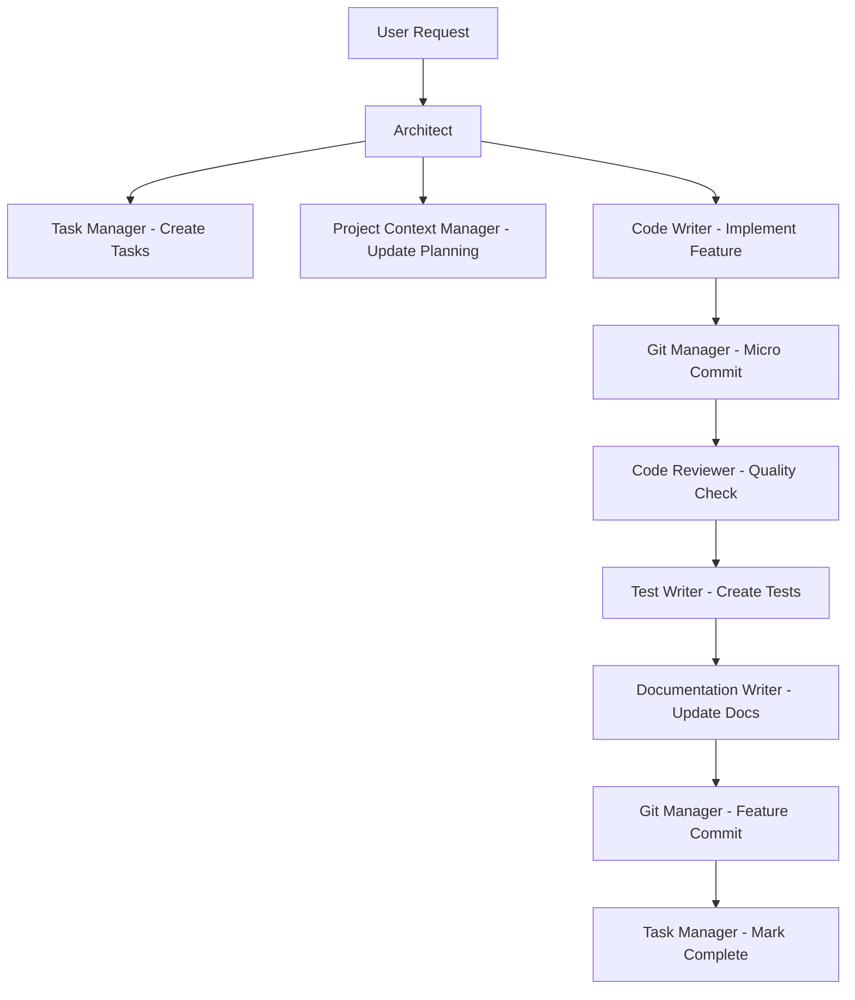

# Claude Agents - Development Workflow Automation

A comprehensive system of specialized Claude agents designed to streamline and automate software development workflows for solo developers.

## Features

- **9 Specialized Agents** - Each with specific roles and expertise
- **Dual-Commit Strategy** - Micro-commits for checkpoints, clean feature commits for history
- **Automated Quality Assurance** - Code review, testing, and documentation
- **Multi-Technology Support** - React, Python, C#, RhinoCommon, and more
- **Task Management** - Automated task tracking with archiving
- **Context Preservation** - Comprehensive project documentation

## Quick Start

### Prerequisites

- [Claude Code CLI](https://claude.ai/code) installed and configured
- Git installed
- Your preferred development environment

### Installation

1. **Clone or download this repository**
   ```bash
   git clone https://github.com/yourusername/claude-agents.git
   cd claude-agents
   ```

2. **The agents are ready to use**
   - The `.claude/agents/` directory contains all agent definitions
   - `CLAUDE.md` provides guidance for Claude Code
   - `PLANNING.md` contains project context
   - `TASKS.md` tracks active work

### Usage

1. **Start Claude Code in this directory**
   ```bash
   claude
   ```

2. **View available agents**
   ```
   /agents
   ```

3. **Begin with the Architect**
   - Simply describe what you want to build
   - The Architect will coordinate all other agents
   - Example: "I want to build a user authentication system"

## Agent System Overview

### Core Agents

| Agent | Role | Primary Function |
|-------|------|------------------|
| **Architect** | Orchestrator | Analyzes requirements, creates plans, delegates tasks |
| **Project Context Manager** | Documentation | Maintains PLANNING.md with project information |
| **Task Manager** | Organization | Manages TASKS.md, archives completed work |
| **Code Writer** | Implementation | Writes code across multiple technologies |
| **Git Manager** | Version Control | Handles commits, branches, and git workflows |
| **Code Reviewer** | Quality Assurance | Reviews code for quality, security, performance |
| **Debugger** | Problem Solving | Identifies and fixes bugs systematically |
| **Test Writer** | Testing | Creates comprehensive test suites |
| **Documentation Writer** | Documentation | Creates and maintains technical documentation |

### Workflow Example



## Key Files

- **CLAUDE.md** - Instructions for Claude Code
- **PLANNING.md** - Comprehensive project context (maintained automatically)
- **TASKS.md** - Active task tracking (maintained automatically)
- **ARCHIVED_TASKS.md** - Historical tasks (created when needed)
- **agent-workflows.md** - Detailed agent interaction patterns

## Development Workflow

### Starting a New Feature

1. Describe your requirement to the Architect
2. The system automatically:
   - Creates tasks in TASKS.md
   - Updates PLANNING.md with context
   - Implements the feature with micro-commits
   - Reviews and tests the code
   - Updates documentation
   - Creates a clean feature commit

### Checkpoint Recovery

Thanks to micro-commits, you can easily revert to any point:

```bash
# View recent commits
git log --oneline -n 20

# Revert to a specific checkpoint
git checkout [commit-hash] -- .
```

### Quality Assurance

Every code change goes through:
- ✅ Syntax and style validation
- ✅ Security vulnerability checks
- ✅ Performance impact assessment
- ✅ Test coverage verification
- ✅ Documentation updates

## Configuration

### Agent Customization

Agents can be customized by editing files in `.claude/agents/`:

```yaml
---
name: agent-name
description: "What this agent does"
tools: read, write, edit, bash
---

Your custom agent instructions here...
```

### Project Context

The system maintains context through:
- **PLANNING.md** - Overall project information
- **TASKS.md** - Current work tracking
- **Git history** - Complete development timeline

## Advanced Usage

### Multi-Technology Projects

The agents support:
- **Frontend**: React with Tailwind CSS
- **Backend**: Node.js, Python, Supabase
- **Desktop**: C#/.NET, WPF
- **Plugins**: RhinoCommon for Rhino3D
- **And more** - easily extensible

### Team Collaboration

While designed for solo development, the system can be extended for teams:
- Shared agent definitions
- Centralized project context
- Consistent development practices

## Best Practices

1. **Always start with the Architect** - Let it coordinate other agents
2. **Review PLANNING.md regularly** - Stay aligned with project context  
3. **Trust the process** - Agents have full autonomy within their roles
4. **Use micro-commits** - They provide checkpoint functionality
5. **Keep context current** - Agents work better with accurate information

## Troubleshooting

### Common Issues

**Agents not found**
- Ensure you're in the correct directory
- Check that `.claude/agents/` contains the agent files

**Context seems outdated**
- Have the Project Context Manager update PLANNING.md
- Review TASKS.md for current work status

**Git conflicts**
- Use the Git Manager agent to resolve conflicts
- Leverage the micro-commit history for recovery

## Contributing

This is a template system. You can:
- Customize existing agents for your needs
- Create new specialized agents
- Share agent templates with the community
- Contribute improvements to the core system

## License

This project is available under the MIT License. Feel free to use, modify, and distribute as needed.

---

**Ready to get started?** Run `claude` in this directory and ask the Architect to help you build something amazing! 🚀