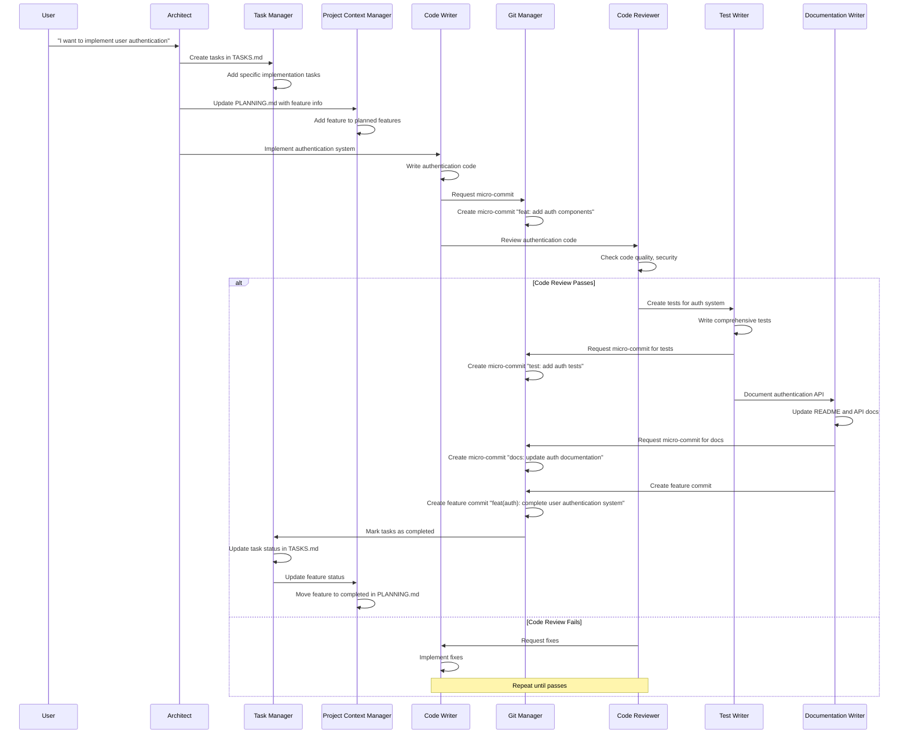
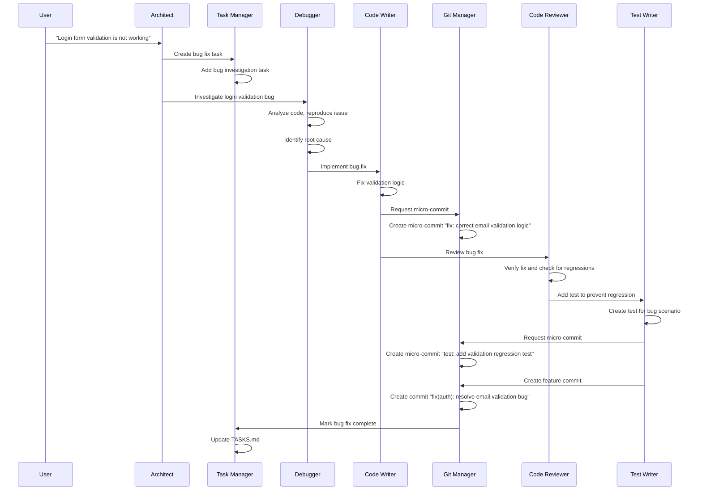
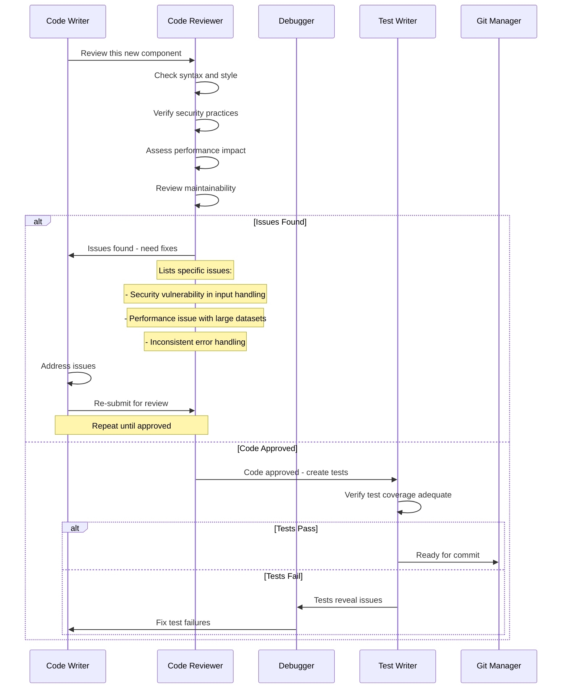
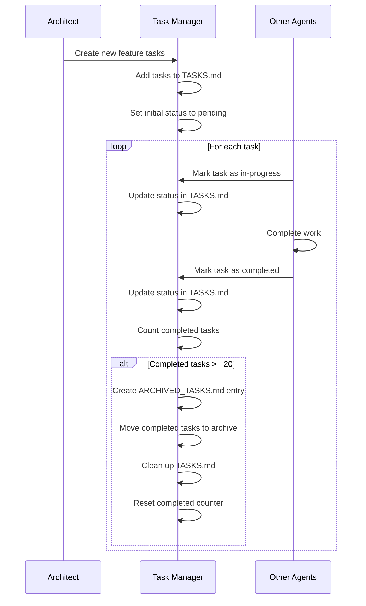
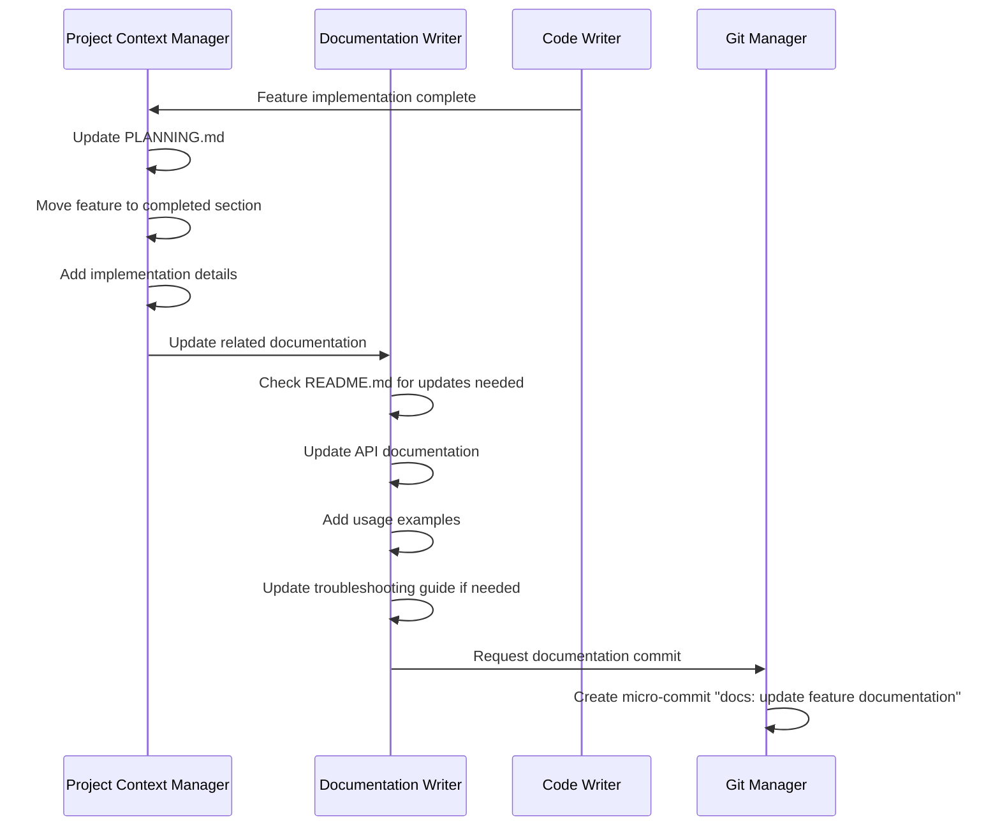

# Agent Workflows - Detailed Interaction Patterns

This document describes the detailed workflows and interaction patterns between agents in the Claude Agents system.

## Core Workflow Principles

1. **Single Source of Truth**: All agents reference shared files (PLANNING.md, TASKS.md) for context
2. **Clear Delegation Chain**: Architect coordinates, specialists execute
3. **Autonomous Operation**: Each agent operates independently within their role
4. **Quality Gates**: Code review and testing happen before commits
5. **Context Preservation**: All changes update relevant documentation

## Primary Workflows

### 1. New Feature Implementation Workflow



### 2. Bug Fix Workflow



### 3. Code Quality Review Workflow



### 4. Task Management Workflow



### 5. Documentation Update Workflow



## Agent Communication Patterns

### 1. Context Sharing

All agents access shared context through:

```
PLANNING.md → Current project state and architecture
TASKS.md → Active work and priorities  
Git History → Development timeline and changes
Code Files → Current implementation state
```

### 2. Status Updates

Agents update status through:

```
Task Manager → Updates task completion in TASKS.md
Project Context Manager → Updates feature status in PLANNING.md
Git Manager → Creates commit history for timeline
Documentation Writer → Updates README and docs
```

### 3. Quality Assurance Gates

Every code change goes through:

```
Code Writer → Implements change
↓
Git Manager → Creates micro-commit  
↓
Code Reviewer → Reviews quality
↓
Test Writer → Ensures test coverage
↓  
Documentation Writer → Updates docs
↓
Git Manager → Creates feature commit
```

## Error Handling Workflows

### 1. Code Review Failure

```
Code Reviewer identifies issues
→ Provides specific feedback
→ Code Writer addresses issues  
→ Re-submits for review
→ Repeat until approved
```

### 2. Test Failures

```
Test Writer runs tests
→ Tests fail
→ Debugger investigates failures
→ Code Writer implements fixes
→ Test Writer re-runs tests
→ Repeat until tests pass
```

### 3. Git Conflicts

```
Git Manager detects conflict
→ Analyzes conflicting changes
→ Resolves conflicts appropriately
→ Verifies resolution doesn't break functionality
→ Creates resolution commit
```

## Performance Optimization

### 1. Parallel Operations

Where possible, agents work in parallel:

```
Code Writer implements → Git Manager commits
                     ↓
Code Reviewer reviews → Test Writer creates tests
                     ↓
Documentation Writer updates docs
```

### 2. Context Efficiency

Agents minimize redundant file reads:

```
Read PLANNING.md once per workflow
Cache task status during operations
Share context between related operations
```

### 3. Commit Optimization

Git operations are batched when appropriate:

```
Multiple micro-commits → Single push
Related changes → Combined review
Documentation updates → Batched commits
```

## Troubleshooting Workflows

### Common Issues and Resolutions

1. **Agent Not Responding**
   - Check agent file exists in `.claude/agents/`
   - Verify agent has required tools
   - Confirm Claude Code can access files

2. **Context Out of Sync**
   - Have Project Context Manager refresh PLANNING.md
   - Task Manager updates TASKS.md status
   - Review git history for recent changes

3. **Quality Gates Failing**
   - Code Reviewer provides specific feedback
   - Debugger investigates test failures
   - Iterate until quality standards met

4. **Performance Issues**
   - Minimize agent tool usage
   - Batch related operations
   - Use specific rather than general agents

This workflow system ensures consistent, high-quality development while maintaining full automation and context preservation.